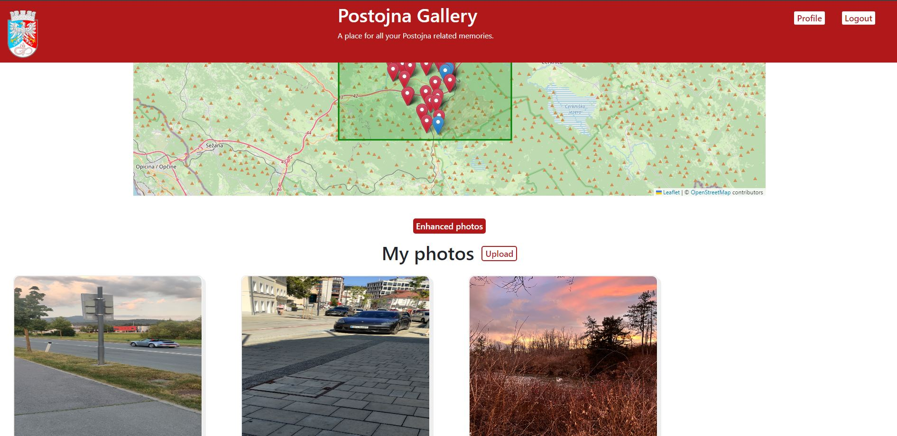
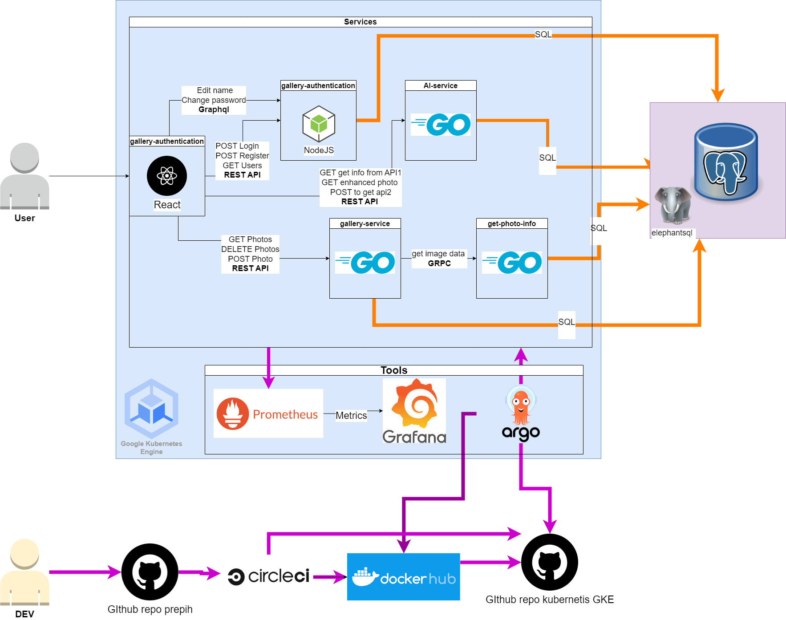
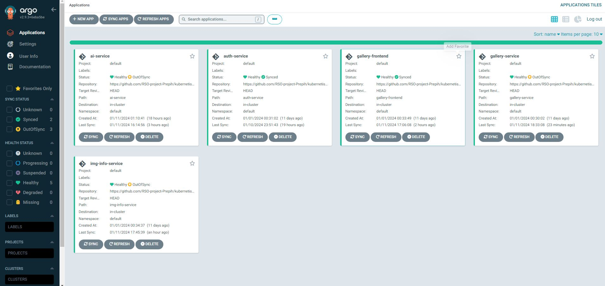
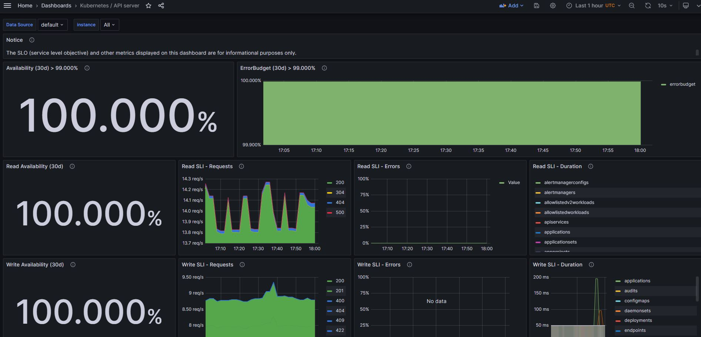
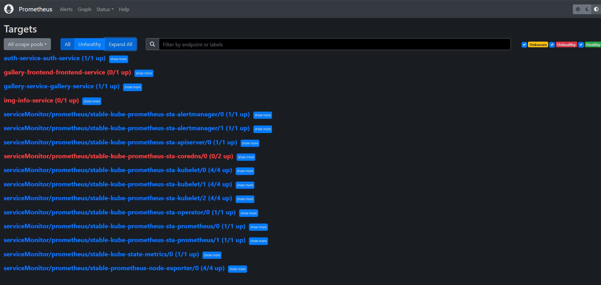

# RSO project PrepihPhoto - PP
In this organization you will find a microservices application that is a Postojna photo gallery and service.

Image of the application:


## Microservices CI/CD status 

- gallery-service-upload-get-deleting-photos | [](https://dl.circleci.com/status-badge/redirect/gh/RSO-project-Prepih/gallery-service-upload-get-deleting-photos/tree/main)

- get-photo-info | 

- gallery-authentication |[](https://dl.circleci.com/status-badge/redirect/gh/RSO-project-Prepih/gallery-authentication/tree/main)

- gallery-frontend | [](https://dl.circleci.com/status-badge/redirect/gh/RSO-project-Prepih/gallery-frontend/tree/master)

- AI-service | [](https://dl.circleci.com/status-badge/redirect/gh/RSO-project-Prepih/AI-service/tree/main)

# Architecture design

## Examples of use
A user first needs to register and then login to the application. After that, they can upload photos to the application and view them. The user can also delete their photos. The application additionally retrieves all photo metadata such as the camera used, location, and other details. One of the standout features is the ability to view these photos on a map, showcasing all the landmarks. Users have the flexibility to edit their profile, including changing their username and password. Moreover, the application integrates AI technology to enhance the colors of the photos, making them visually more appealing. 

## Scheme of the application
Here is an example of the scheme of the application. 

The current schema of the app:


*Old schema of the app  not in use anymore*


# Database 
The database we will use here is [elephantsql](https://www.elephantsql.com/). Just log in to the database and then you can access the database using [dbeaver](https://dbeaver.io/about/)(**IMPORTANT NOTE** the URL must be in the JDBC URL format so converte the URL this jdbc:postgresql://[HOST]:[PORT]/[DATABASE]). If we will use all of the memory on the database we can migrate the database to [fly.io](https://fly.io/) or some other database service. 

Link to the elephantsql docs for [node](https://www.elephantsql.com/docs/nodejs.html) and [go](https://www.elephantsql.com/docs/go.html). 

### Schema of the database for now 


# Docker configuration
Docker hub links 
- [gallery-service](https://hub.docker.com/repository/docker/jabok123458/rso_prepih/general)
- [auth-servics](https://hub.docker.com/r/tinec/auth/tags)
- [get-photo-info](https://hub.docker.com/repository/docker/jabok123458/rso-infor/general)
- [AI-service](https://hub.docker.com/repository/docker/jabok123458/ai-service/general)
- [gallery-frontend](https://hub.docker.com/repository/docker/jabok123458/gallery-frontend/general)

For the docker configuration we will use the dockerfile. Here is an example of the dockerfile for GO:
```dockerfile
FROM golang:1.21.3 as builder

WORKDIR /app

COPY . .

RUN go mod download

RUN CGO_ENABLED=0 GOOS=linux go build -o server .

FROM alpine:latest

RUN apk --no-cache add ca-certificates

COPY --from=builder /app/server /server

EXPOSE 8080

CMD ["/server"]
```
For the docker configuration we will use the dockerfile. Here is an example of the dockerfile for nodeJS:
```dockerfile
FROM node:20-alpine

WORKDIR /app

COPY package*.json ./

RUN npm install

COPY . .

ENV PORT=5000

EXPOSE 5000

CMD [ "npm", "start" ]
```

We also need to add the build image to the [docker hub](https://hub.docker.com/). The CI/CD will buld the image and push it to the docker hub. But we need to add the docker hub username and password to the CircleCI environment variables. 
So hre are the steps to set this up:
1. Create a docker hub account [here](https://hub.docker.com/)
2. Create a repository on the docker hub (give it a name and set it to public)
4. Get the docker hub username and password(token)
4. Create a CircleCI account [here](https://circleci.com/signup/)
4. Add the project to the CircleCI
5. Go to the project settings and then go to the environment variables
6. Add the DOCKERHUB_USERNAME and DOCKERHUB_ACCESS_TOKEN variables (Name == DOCKERHUB_USERNAME and Value == docker hub username and Name == DOCKERHUB_ACCESS_TOKEN and Value == docker hub password)


# CI/CD 
For the CI/CD we will use CircleCI. To configure the CI/CD we need to add the following files to the root of the project add the following files: .circleci/config.yml. You can setup your CircleCI account [here](https://circleci.com/signup/) or we can use my account.

here is the example of the config.yml file for GO:
```yaml
# Use the latest 2.1 version of CircleCI pipeline process engine.
# See: https://circleci.com/docs/configuration-reference
version: 2.1

# Define a job to be invoked later in a workflow.
# See: https://circleci.com/docs/configuration-reference/#jobs
jobs:
  build:
    working_directory: ~/repo
    # Specify the execution environment. You can specify an image from Dockerhub or use one of our Convenience Images from CircleCI's Developer Hub.
    # See: https://circleci.com/docs/configuration-reference/#docker-machine-macos-windows-executor
    docker:
      - image: cimg/go:1.21.3
    # Add steps to the job
    # See: https://circleci.com/docs/configuration-reference/#steps
    steps:
      - checkout
      - setup_remote_docker:
          version: 20.10.6
      - restore_cache:
          keys:
            - go-mod-v4-{{ checksum "go.sum" }}
      - run:
          name: Install Dependencies
          command: go mod download
      - save_cache:
          key: go-mod-v4-{{ checksum "go.sum" }}
          paths:
            - "/go/pkg/mod"
      - run:
          name: Run tests
          command: |
            mkdir -p /tmp/test-reports
            gotestsum --junitfile /tmp/test-reports/unit-tests.xml
      - store_test_results:
          path: /tmp/test-reports
      - run:
          name: Build Docker Image
          command: docker build -t jabok123458/rso_prepih:${CIRCLE_SHA1} .
      - run:
          name: Push Docker Image
          command: |
            echo "$DOCKERHUB_ACCESS_TOKEN" | docker login --username $DOCKERHUB_USERNAME --password-stdin
            docker push jabok123458/rso_prepih:${CIRCLE_SHA1}
      - run:
          name: Update Helm Chart
          command: |
            git clone git@github.com:RSO-project-Prepih/kubernetis-GKE.git
            cd kubernetis-GKE/gallery-service
            echo "Before sed command:"
            cat ./values.yaml
            sed -i 's|tag: .*|tag: '${CIRCLE_SHA1}'|' ./values.yaml
            echo "After sed command:"
            cat ./values.yaml
            git config user.name "lovc21"
            git config user.email "jakob.dekleva@gmail.com"
            git add ./values.yaml
            git commit -am "Update image tag to ${CIRCLE_SHA1}" || echo "No changes to commit"
            git push origin main

# Invoke jobs via workflows
# See: https://circleci.com/docs/configuration-reference/#workflows
workflows:
  sample: # This is the name of the workflow, feel free to change it to better match your workflow.
    # Inside the workflow, you define the jobs you want to run.
    jobs:
      - build
```

# Kubernetis
For the Kubernetes deployment, we will utilize [GKE](https://cloud.google.com/kubernetes-engine) (Google Kubernetes Engine). The application will be deployed using  [helm](https://helm.sh/), a powerful tool for managing Kubernetes applications. To expose the application to the internet, we will configure [ingress](https://kubernetes.io/docs/concepts/services-networking/ingress/), which efficiently manages external access to the services in a cluster.

For monitoring and metrics collection, [prometheus](https://prometheus.io/) will be employed, offering a robust solution for gathering and processing real-time metrics. These metrics will be visualized using [grafana](https://grafana.com/), a platform for observability and data visualization.

Lastly, log aggregation and analysis will be handled by [loki](https://grafana.com/oss/loki/), a horizontally-scalable, highly-available, multi-tenant log aggregation system.

## Helm
You can finde the helm chart in this repo [here](https://github.com/RSO-project-Prepih/kubernetis-GKE). The helm chart is used to deploy the application to the kubernetis cluster. The helm chart is also used to configure the kubernetis cluster.

## ArgoCD
ArgoCD is used to deploy the application to the kubernetis cluster. You can find the ArgoCD [here](https://argo-cd.readthedocs.io/en/stable/).

Here you can see the deployd services on argoCD:



# Collecting metrics
The metrics will be collected using [prometheus](https://prometheus.io/), [grafana](https://grafana.com/) and kubernetis cluster.  You need to set this up in the code. You will need to expose the metrics endpoint in the code so that prometheus can collect the metrics. 

## Grafana
grafana ip http://34.78.218.192/login

Here you can see the grafana dashboard:


## Prometheus
prometheus ip http://35.187.39.50:9090/

Here you can see the prometheus dashboard:


