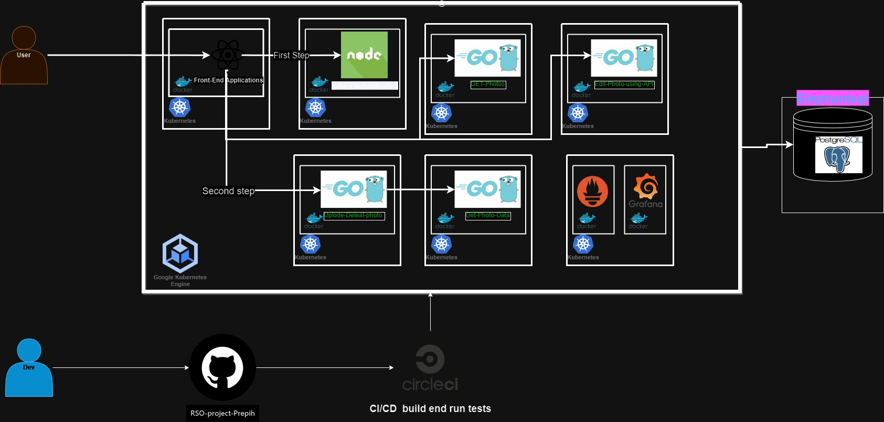
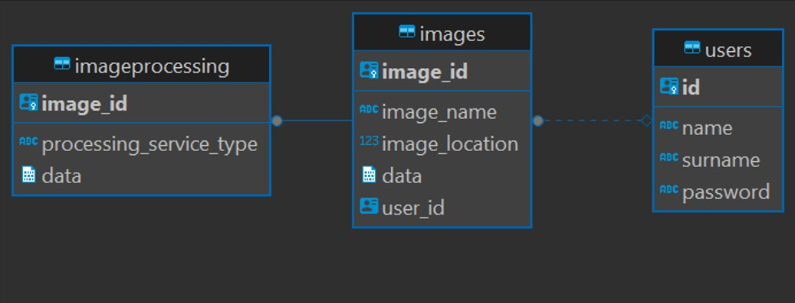

# RSO project Prepih (ime je subject to change)
In this organization you will find a microservices application that does **[not yet not decided]**.
It is written in the following language **[not yet not decided]**.

# Architecture design

## Examples of use
==[TODO]==
**[not yet not decided]**

## Scheme of the application\
Here is an example of the scheme of the application. If you want you can edit on this [link](https://viewer.diagrams.net/?tags=%7B%7D&highlight=0000ff&edit=_blank&layers=1&nav=1#R7V1bd6JI1%2F4t70Wv9c4FLo4eLk0wafsLGDvaaXMzCxERRfEFjMCv%2F%2FbeVRgVc5p0utM9lTXTxqKowz48e1fxFPmknS%2Bzy9hZz6xo4oWfVHmSfdLMT6qqNnUZPrAkZyWK0dBYiR8HE172UHATFB4v5Df6m2DiJQcV0ygK02B9WOhGq5XnpgdlThxH28Nq0yg87HXt%2BF6l4MZ1wmrpbTBJZ6y0qTYeyj97gT8re1bqLXZl6ZSV%2BUySmTOJtntFWueTdh5HUcp%2BW2bnXojSK%2BXC7rt45OpuYLG3Sl9yw1fzIv9%2BvfC%2FzdJka89afzf9taSpfHBpXs7Ym4AA%2BNcoTmeRH62csPNQehZHm9XEw2Zl%2BPZQ5yqK1lCoQOHcS9Oca9PZpBEUzdJlyK8maRwtdvLUoISNArt%2BdHa8KIk2ses9MaXSSpzY99Kn6tV3SgDz9aKll8Y53Bh7oZMG94cDcbgZ%2Bbt6D5KGX7iwXyF43u69E254T8PEiyvKAKNZkwzdNIpBTttZkHo3a4cksAWfOxTsNAjD8yjEqnC3Np16ddfdCXzvyqTRGsuovWm0Skttl2Py4tTLntZDVWz8htLhub9rDb1W5za2ffCfFq81O3Ad%2Bb1k3Wj8CisHicX5d34%2FfRnhl5pRfjWz%2FYtmzr%2B9q3foL%2FWOxi91D73iHp9Ky9r3jm2wDJ2VR0Jz4pSrQj7QHgFOib34xY%2BdSQCCK91hFVEL%2B74z8abOJkwrymjslPEmJ9EU7dBLNLniIoqiNapOYhjv5SRGVeKvEPdjNvuMmB7X%2FeOyaxyKrio5VdaqglPfDV0aFcH932bsxSsvhbylIsKFl7ozLrQ9rEA5BZB1tMPAX0FZihhzFjpjL7yOkiANIix1QXBevFf96qjCOErTaAkVHN7O7o4EYkaw8geEXVK9RH6mQUWpRAL2fS9itOiH%2BRKFpGBJqdOZk6xZ4jUNMnS4M7rQLkvlsgTdykmdT1qbfVUvknv%2Fk3qWgRDU8%2BvPtnqXn%2Bnj22zjFnLgfP4qu2Z0f6VNtEluaFZu3LtL996at7fWeauYLN2g%2B3mWji%2BNorcatbrLmTz5fFb0gub9ZPltPrnsbJzb5v14ebEZ511%2FooaLyaXf6s7drRXoum2OCmtgyXYxUux5V%2BkGZ9HdbbhyPvehzki3bnTDnruZZXa39qCt9cxODnVU5%2Fab1l%2B29Oubbmad61vL7Gyt%2BSizBxa005fh07cG7Y1ltre9gVVAmWYNhgr0k3fNR%2Fo2H%2Blvri%2B72mzW2y6arvbVGF8O%2FcnncHs3AIu8%2FKZPzltzV7OC62A09y47jfMbo5iYZ427ZZiMzWhuFV11pA6VniaX7WxcrZ956t16fLmtd9W75d08bX0JbH00SL5co1w%2Fh8ndYK%2FfywvZOT%2Bbjy8vCtQL3L8FOSyub77YVjHUr%2BYL3c7bJAt7aaV2oOcwt41VdIqrQSe%2Fmltb66adXc19xT6XMzvXDcsc%2Bfa5rljFhdUbjDZ2YWlds1OADArb%2FDJn9%2FkZ3KdezTtZ71zOQW6ZNRiBbN2NPfeNq0FXuZp3QW5tvE%2B2illyNRhteVkOct1Y82%2FQVndDsjSxTZBtLm%2FsQVfumng%2F1DvHPkAX5%2B3CvqExzUA%2FMP6hX35a5%2B1t12z7MAbVxjHkutozZwmMx4Dx5Tb0RzqHMY8KH%2Fob6dBfhu1bAf6vo77Z2M2%2BbxUw54GVQR3tat4vepfb3C46cH%2FHuLoBOc6%2FzK1BH7%2FDmNtQrwv1wFZyGcdq2AGMNcCxdlLWZlsdmx21R%2FdaKdwHcrAyS7VAPz74jgyyBFud%2BzAGkMtgoTH59VWYN8wBZSgXcD%2FMI%2BRytDT7Rt6TI%2Bh0MFJAN8XV3JVBJxnMS4Yxwfxxfgvod0gygLoZzsuWtwXIHvTVL2Cu8tV8aFhoIzmME%2FqDPlRsB2wBfKKTwqcBvgTtdOGeoXoFMkA5eUH3fmfjg2w7%2Bv416l7ayei7XYAdgs13fLDL%2FMEuR9j%2Ftgdz6%2BHYzBmM3wefdEGOgB831KcKffkwFpA99Il9kS92QMb42fZBt0XvnOQG8xpxOYGtmaMU9QK6hX66We9GxrZRT2ibOuoQdIN2AjLUM8ABHz%2BhHx9tHPTjw7gyq3B9bMPiPmGh%2FJkv5dAe2hvIH9qBsdvzEfoIH2MXxjhEncH3joH99kg3aOttkPUQymGuOCe041wHnLGTK%2FKvvg%2B2k%2FW4TOwCZeLmoEf0TRXsA%2FsFDEJ9gp2a6Jtgi4BZoFeou4A5tcGuRmDXsgZjVcH%2Fc5ATtGmlvQH0PUCsG5K%2B0eevEB9v8BOwMpChvC9bpP9ODrLjfozfXZoDzAnqWgrYrcJ0Ab4xAKwhOfgazAPspY9Yo9jmEO2GdIK2DdgJdoP239dxTiBnjWwT%2FARxgOy4aCv4CXXlKxwvYBjYPFzvg%2B0uSMasDabbnrnIoU8NZJqSTgbgYzAGC%2Fq20H7AT%2FhcYQ5tjeZg9qlNaDujvoquzNrs4Ligng%2BYQ7IAf5ZxfjLOr2ciNqGecWwoB%2FD7AMY778AnygNxijArYz7UJ5uxKX74aHNKbwAYM%2B%2BgHmg86Ps2zB9sXCMdkJ8vsE9oZwEYoEO8Ib1nIE%2B0Q%2FhuYVvMjgPEVx8xOwMZUDnYDdqVAdiN5YCLHY4tqC%2Foy1zAPNC%2B%2BhrZo9lGDIbxL4weYY5POI19wXxw%2FDnoh9k8%2BgJgJs0DMNcqFmizKmFoAL4CY%2BmdM8zHvnsmGxuzacJ1A2RS2Oh%2F835KeFu0YRy%2BTLgA%2BuoxG4IxI1YtEIPRnjLAMD7%2FC4xDaIsYK2A%2BPtkM2IKC84E2FdQv4l2X4kQf9OVibFGofgG2ArbVG6AcwObmaFvot2hToFvE5xz1D9hSLAzS%2FaAPdtRROT4x2d%2FQmFL6pNjaRRtUGa5CvMAxoc3PF1uyI7OPOt8yTPJzFoNk0gvHefRlxEG0H7QBLEc8Z%2FFn3lZhXOTffN4Yx2W0P9Abz3mYr8EcFRbDIFZrFscty2d%2BOES8oviD%2BrVIT6Af1j60y9q0z%2Bl37QFHUR%2BA21Tezclf6HeXxRawZbILtGFzATjcVTH%2BEoadY2wfZShvu6C6pGMb8dgkny0g3tHcmA9aW5pTzmRsc9wG21Bt1F8O8Q11QDkHYADqGzEb4hzIDsY89Mn%2F5x0ch8L8cmQgHvL4oKO9gf%2Fm6Ge9263K4yrN0b60KA5BfRn6ltHnbPIVtDnUXVdGrIU6BbNVxAGQ83KblrkI2GxhFxCf5wuF9dvXmDxwXljfx%2FwE8RR9Bsa6wHt18qkc7oWxo59Y6Htgr%2BQPFOO7EPvAduBaD%2FGO2ZxPdml2UVYy%2BoqNsjN9bIP7U6eMgZDzLlBPoK8RyZ7ytwB8slgQfmJsothX%2BCnFysECx7i1oX3KVxCTELcAr8nHWKwDDHUROzTSPeRCiKGoR8w9AcNBFx2DsIUwwU1p3jfMbkkulAvR7%2FmDT1iZS3YJvknXwY7PWfkI4yebA%2BCj5bM8tc90YJIt6hbKKKdYw%2BJn0cW4pNksjgMOdXEcUG%2BIMsxZTLIod0N7pXFirCKsX2BMwNhlUHsgU8jlC44fGtgw5jdKj%2BzIldn9Fo87bYPhUZvFOnOSwLgw%2F0whPy%2B4vH3K0SGvBKxG%2FMsxh6ecco4yJ3xGO9IIV5aQg5sLzBUwF4Frrkb5MOXFDG%2FB99AfVLDNgufECvnZrYWxEXyAzx38lo2%2FCzkstt9XGR5iPoO6hPUE%2BZEPGIafLq4DWI447%2FO1FebOXZ5fMFmgD1F%2BSbbf0XrMzxXWNuUQBfNF9Okus0uTPnOb2aVqsdinU5yh3A3H4xss32nrhGMQf2yyyw5ijMbskTBd52uPEsuwP43FOswvMJdHXTE7Bl0xO77dol0ZhKmkm8mc6RHrYP7rp5Q7zilvBp%2Fvl76WMl%2FDPBlzLtQ%2F5Yk5zzMQt9H%2FFZ6rG%2BT7c4v3jzkV5FKUmyxwzBT%2FoL9dzOlRjjwEPxkSTsMYFIqJhUVjA1tJWW7g4hjZus5sw9iHaIsoOx3mjzliDnEwpbWE2c1YHKb4B9gxwniEuQHLs%2BZdxE%2FMd3RaK7PYzzEM7Qz1S%2FggY85BvoTfc4aRLA8lPCEsR1kBPvE5LQjjQO8Fy2ktjuVtwnLMI3ts%2FprF8DIjf8jZd%2FIZiu9DyocpL8W5ot4Je4fgv5iTUo6Ea3jMOQsaN45n3keZlzkZ5juUJ2FMJHwi%2FMWcrI25OMvRyNZRry6XEa0DNO5zuE7WwPYyxBbA0xT9A3NkN2f5NK25cT6AR2XMBh2ymL2kmJijTeEcWD4JeAj5AqxVuI4x96C8U6dceDCSMUcGeWB81Wi9NuizuE02tcudcx7nNMxn0JZ6LG8G%2F7FobcHssI97BRyrRjprY5ESTgxoTcjWhgHHMIx35tfkinIryvVhrB1jVND90A7lDAq3E8gBZYytIMsO2QTisE3rOVynYh6HeTraKs2fcAbGhFiCaxLARba2sNFvIMcbo%2B4Hvk6%2BCb43Qj0VtC5QSb%2BmVbB2XZXWgwX5EeW2qAeaE60hOxyDAWNAnoD%2FGNsytgbqlHsblCOBPnJaM%2BWEx0xmYANsT4PWBdweCJtSykEo5%2BjmPEZgfCw4LvG1SrvMARX6TrnKqKDcE2Vv7tYSKV9L5G5O8oF8wEU9GJh%2F4TW2ruqQHkc52sgCY4RhUV%2BWwjDah1wC7YvlxxDrZZa7YgxC2bo6y6%2BGlE%2BDTmW2FhuCHHdrMcJWi%2BKGlWOMxNwN1hg%2Bi6UW2g%2F2jXic7XCS8h1aX6skfxh7j%2BGJztZcrsLzM9QN7slRXmLPwznby3AJz8tcD%2FpD2wM90RqX7JxkZKI9Dinu2JCjsX0lma3Vby2O8322dpxTfpBTXorYhRhK6zDKxwrM81EfTLe%2BSmtc8jWUEVsTM%2Bwv9wIwZ12wnGO%2BYHGM5T4aYRPldLhGwPyqz3IZ6JP2wMi%2BfJ5nox%2F3GQ5RztTBNmCdV663fTaG%2BTBj64IRzZ8w%2Bvs6hTKdsB33NbhOxrTOpT02DerRepzVwXhzN79CLEQsR7zHOIcYcU6xluVZtK9Ba42c2rnsZKTToF1%2Bsv05lpNzXOyTPlkuwvbFMP4wzOiz3AHyb9ofKrAPxNoO2F5f5muUgvACbI0wHWNMseD7drjPxbAHsCBn9knrO4wHBlvnluMY6ba2ZmtQsuWzuYVYNXd5DFrA%2FSPsE3N9HE9GebDp8r0eXBN2FZChiuNg46PYudsv7A2%2BzkhGfA1On5Sb8f1B3DPh2A%2F%2BifasMd%2Fs5uzTxT0xXIsWDGsgNpDdlTIEeQTMNryFDHhH63zENx33QiHnUwgncU%2BAcAD8iWTepX3gEdvP1Zn%2B8JNyx%2BxhPwvjUalf33j4ZPXYPopP%2B1C010l2OiK5wJq7YDZIewmYb7K1BNg%2B6BX37RSSc9EF3MR17xDz55xyeMRmFgNkbwlYj3uELP6iv%2BroVzZbHwJ%2BYPxHv19gzmcQPgc87uIak%2FIYK2O5OM0N%2FRLW1YjhLq4NmT2x%2FZOM9ixMFt9hPhraClsjdR%2FkzfBU5evVjO2Jy2wtDT4EfcO6pJsymxnRfgPFUsRx0iPm6agr9H%2BMW53S5mS%2B3yWPS59nbfhsnwjlOszId5hPy7TPR9epj8IxMWYirm35XuqQ9il3cRW%2Fz7ss%2Fxl0M74mwLGzsc7L%2FHO3J6YwfXaZ%2Fa3WgLNDwo8u6RrWFir3%2B7xdfnK%2F5%2Bvrcv%2Ba%2BqK9DbBRV2Uxkt1Da2XaV%2BvIuHZkMgebKTDnRp9E%2FMa9HNwDxzYJsyAOYs6Beh%2BqtO%2FJ9oGZLCm3ZM8aIG6pLI5hblfirsv2iDCXoucduI4F26c8y2V7CLiXT3vFrk%2F74Lgmphzxoj6m%2BOLyfR7c1yc5cD9ZlL7u7%2B3JbNm6luas2fnus8RJPgZsE%2FGZ55qkO7Jt3MPbInb1LjFXwzV4X2N5I9g0YEWP5dOpTfbe5fLCdbmsUYyZf0lIfzcy0xXfGyRdLPGevsJsju23YZzBfI3lBmSPqMv6mPYwXfac55zFZFxfQ66FfoK%2BjNip9WhNTjGk3Dcr9xNJ99i2xdaIkBNiLtTR2P4ItQ2f3yLy6dttwXNv38Z5k177mx5b96sYu3Cd3mPPgdi%2BEl13Gc4MKCbr9GyF1q99jCWKXe654HMvE3CnnCfl2N8S0Bv3O8QosN9bn9YYDDsXGdd1toedW77npzJ%2FiYLuZ1t2l60Ynw%2BOl63N3U3Xd7Wv%2BVhNw6vvk%2FXd56%2FR9Q0%2BzxkGVwV%2Fxlds713tbnXt42Ne%2FO8NT%2B6NJ5%2FcK0rNOHh2r%2BjNysN7Xa0%2Bu9ffjRj0cUgPrxSdeoIw0jxFqlKb7yW7ExSdY9mVFIED1kOFL7BHg1hHwSqlkRpnnwzzFJFhn7ag7nELgqUP8wiDMc4mcR0kGJiRu%2FDiGvIM3qIb5WnlNI9006rqRqvXjFZVO9q7GXb9hHLqRGiaBPfwq5%2BSRFjRuCy4iEG4Umc1gVvb63UYuA4SS5KyIoxlfHwzlB00%2BQiBsTSFZzkvz1JbiBRz5rgLnzheB3RH%2FDnJQDlNUoHvszRFJnEb5a1euJOVUgvcaDUNVhOwHBd6hPkhbUW9wPIEP6MV%2FSohY0y6j0IJtWUo%2BG8Y%2BZEUe46bSuB6tfXKfzezaxzbnaLXWq2K6dVbNdWomt5e8Q%2B3vhIJPgCsPs0lU1sfjUymaoJNJthkgk0m2GSCTSbYZIJNJthkgk0m2GSCTSbYZIJNJthkgk0m2GSCTSbYZIJNJthkgk0m2GSCTSbYZIJNJthkgk0m2GSCTSbYZH8Wm4yxBl5BJzNOEG9atVO8m%2FciRakvIEW9mPmg%2FlTpvZhR9m6kJfUFbLw%2FhFGmPs1L%2BYCMMq1KTCkZYA4UIxdDmjjxIvaciRdLwSoMVp7k7hgf9f9tIk4b2%2F322F1j%2F5n7HgyiLBxHmZQERbDyicslj6MYG4Ridsd4xxcrx4S1Yn%2F8X6TygEhk5DPSZ%2FMvdguahTR1lkGYs9qSs16HnpTkSeotWeUzGO%2FCctwbKruAO1g5DMxZIueGD%2B%2FG8yMwH3nYPb5yur4dpREU3zjEvTtxw2cvvPeQtMO%2BtuPACdmvCdwjJV4cTE83jbw%2BHAoj46hyZxnNg5eNan8Wj9xHkgN3SCXuZm1SF8AcuyQ9pe429anJTXkse4%2FX36t978T%2FPahCXVcLpj5NVyrf60bTe%2BnN1B80Ud79FzeQ58fxmm5P9KLK%2FwmW6yhOnVXFBWaxNz3wgEMiox%2Bks82Y8xe%2F3vSkdRzNASSl69hbBzOs4YShF%2BeSs0lnAFac6nnQhxs6SXLQyfEgq96cbuJxJE1jZ3nooNBtBHMEyAWv2q9UaWE9d7Ij19cO7sYK9MUBa4gPIOKAmToldzwBFuTZCSE%2BKk9R19mReB%2Fhxz4qs6fYsWwYlWLnz6HMys9SZsNo5UvsJYzS1htLZTkjza6iiTdP3k6YfSaq1o%2FDqlFTqq8mbZ6IqmXZj4%2Bqp%2FLFV1pv%2FRHrvQjiBFu4Sb31o%2Bb4h78V9U2vQGUpzxvegMpvvcYUdC%2Fzbh6SjlutWl1u1ltG3VCVhtY6sjX2RlfexoO5VZrV6o1aw6i0rLR2P%2FX6YctMAJWWyZB3032Dbbd%2BFxb4kUJOpds%2FmQZenngSNHBBAxc0cEEDFzRwQQMXNHBBAxc0cEEDFzRwQQMXNHBBAxc0cEEDFzRwQQMXNHBBAxc0cEEDFzRwQQMXNHBBAxc0cEEDFzRwQQP%2FU2jgjEfwW9HA9epfd%2F5VNPDXSu%2FX08DLN8D%2BC2jg%2BtN%2FJvgD0sDrVRr4cB1GE08yvdBzUmk9Q%2BryufqpfeLPNR%2BRPP4pb%2FHhrzOfZri8gjxyyGXcbre1VZAlUbih955yMuMGZuhMkK%2BoyugfF3ID%2FrmMwH19qSHLmdYyiLlYjpjI59XRHpFfZPniQmm%2FpwEB7DVbez%2FNQ6A84eqqUWudeFtoQ6nJjXcyKUOpGMpPoCH%2BQDqh8kI%2BYf19%2BISSoss11Wg0VU4jlPUDNUtKw6g1jrh%2FL2UV6kZN3jehI4ahXq81VEMufxTtZRTDdhw7%2BV41js5PTvGw38aR2bEWfyh%2F0TgVh17JzW0%2Bws298dyI3rKcvJKcS1B5aMmVQHYMistgMmFO48HQnHFY5hnVoPgoEsFwV4Ce%2FOZPuzTh%2BfeaP41Qck1RjCNzZV%2F%2FqVeUVaLpNPHehdhatYvLKPLpUM0%2BSRNcQVNQzJ2VH0CeJ1ibH461aeX0NHQ%2BNGCFnMMKD59K64esTUtjO%2B19qAOrRVg52YWvH7E2aQXcIzbBAp9KIeNMsweuTsynQXtLT%2FqKBe54FvZ8mOPu0I6JWWSMIXlzJnvfz8Lrmy%2Fy3feZfIV8gbwLcim5lFcrW7Y%2Bp0vnNkt6gT27u7WDu2WnMb3Z52pe7Lia9nxk3F2O1COuZr7jahZ9mNm3pW3u%2BJrNK82WvdssfJob1w66lyCdhSyzZ%2BywJu5s%2BXNbWKN%2Bp70VfE4n057%2BcsvrdenZGEgR17W41yPT8xBa91%2Fc0nMz0y1w34w4jOf0XF23B3bC9geRh4Z7wSDZcIR7MzBa1jaug9nzZHyuj%2Bts%2FH2Uf5tbuOcg4xoc94Z77LkR1L9TLbYnLQ%2FYc98t8Xto%2Fxj6Iy4TPR%2FL6Brfl%2BsRTwWfXSC3qkPcCyuQGYdl%2FrXeDZp7Grv%2BfDYDW%2FNHajZzNavVRQ3CCvrOlIMB7Uq1cQcLd8Lk3uAOd5mQfcB2bGkXgFg%2BGrGfClulHRfzS8IYTC7uHigWMleI4cbYYWh%2FbKdwoVqcJWOZX25xFxWuFc8zH7uldvEJImP3mchEvbNoR3KAu6i4k7fQet%2BRsYe7lRNkruLTVoPtvg01vjumcKaVQU9U6Ik4MTUUy%2Fymst2tEe5E024SMi2I%2FTH4cihJtEv1rtDfupvw9FEA7fAkgK5XU%2BR6%2FXSGXH88Qr0tPT518PYjHqMwjoX3y09RGNXTVeIUxUeOx%2BIUhThFIU5RiFMU4hSFOEUhTlGIUxTiFIU4RSFOUYhTFOIUhThFIU5RiFMU4hSFOEUhTlGIUxTiFIU4RSFOUYhTFOIUhThFIU5RiFMU4hTF8zy8R8inH%2FgUhfGC98H%2FpFMUr5Xerz9FYdSfF94fcoqC2cnvdIqiUT0fdNkZSNd4duIEMUUcm%2FjBxyaesZhj0rtxSKj%2FIOcmGr8rMewDvF%2B3IZhhghkmmGGCGSaYYYIZJphhghkmmGGCGSaYYYIZJphhghkmmGGCGSaYYYIZJphhghkmmGGCGSaYYYIZJphhghkmmGGCGSaYYYIZ9ocxwxq%2FHzOs8XGYYa%2BV3q9nhjX%2BPcywxu%2FHDGtUmWFeyphhkolMDMEOe2922DNW85uww1oVS%2FkJb9UFwcb5d34%2FfRnhF%2FAz%2FtXM9i%2Ba%2BTNktH%2FwNl4%2BbXq%2F7RP1yhdZP%2FvWXuaRb31r72vfeGsoh5w5jfN5H3tPb13Rn6r%2FPm%2FIbVZf8S1sbK%2BeUn%2BpjT3yktz3tTHFOOJl1uUnbcxQ31ZfkX%2BGTf7IP73wnqzYRuujvS6xqVZEJ0ixghQrSLGCFCtIsYIUK0ixghQrSLGCFCtIsYIUK0ixghQrSLGCFCtIsYIUK0ixghQrSLGCFCtIsYIUK0ixghQrSLGCFCtIsYIU%2B1uTYptP%2F9nij0iKbf7I94G9jRT7Wun9elJss%2FpCsIrw%2FhBSbPNpxvIHJMU2q3TvziQoWbGbJFj5Uvu6W7V2QY39wdTYZ2zn96DGNusVS%2FkZtMUsSL8%2FEBXh22jvygNnEb%2BUlMUPQnV8KzGxyjysK7W6ehRBAXka6mFLjGHJb36Cadg0NEAkefejHJmdXJMhQO9%2BWoe9MHpmpZe30ikVtfXkoF9Lv2w03lYfxHDkOu9Av1SazR%2BYhbwn%2F7Ipf7i3kirNVkV4goEpGJiCgSkYmIKBKRiYgoEpGJiCgSkYmIKBKRiYgoEpGJiCgSkYmIKBKRiYgoEpGJiCgSkYmIKBKRiYgoEpGJiCgSkYmIKBKRiYvzUDkzMJfisKplJyCD4AB%2FPV8jtBwmzsyIA%2Fh4WptF7w9q4%2FhIbJbeV34mGq8kveu%2FvRSZeMXVnbBotg6U0CpxbFqGT8vsbv8LsbLZfRCgmY6WyzROVr%2BD841MV1jMKceZvk7ySapltQ899h5EdkD%2BqFosryOpOeqsWZmz%2FPck44tgG4qFYtB4p19d2M5wXvHf4w2Ch%2FNGhU5eqbgf9UaOSm8ntBY5W69y%2BBRix1FCSox87UWTn7cNgkNDy%2B8GYEfN5AGq19GvpRoqjX9sjAslK%2BOnfPfOparfwT8fvmUzdqx%2BThH2ZBreoJlE7orWcOOOj%2Fwtcg5THt36zXLy4OPVnVH7cuuOWipat0y4tU9MxhH0M7BFNDhuCz%2F1MVv9I6IXworbX0PcUZ75WFvuQN%2BaUvIw01SaMYFbGdBal3s3bopcDb2Fkfgu0%2Ft%2FfW01TmcnilfR%2FLyagK2Dh5ugpvfC%2FzfsnptI%2BOj3heZx0lqR974JPpBvQeOCE%2FtbNdSy54GGry8AiPgqKTMXm8nTmpFCTSNWvjpn%2F1Zih8xjTqek3e%2F9EOLKWh11qNvav1iqE00VerptJ4tziqaBWz%2BMDvFGdjffJYDS969mXhkHSyms%2B%2BLVxV1NM6f%2FGpnDeqqLpIN737R73ZcVP0yufQcRqE4V4IUsaO4qm7vP%2FgGFu9097Fs8cPGUzp58cEMeMwhLUa1YyzdQpR3%2B2oiFr%2BfYB%2FoZ%2BoL%2FaTR7LEn%2BUn6omQV6e4BDmzjJmDNHHiRew5Ey%2BWglUYrDyIIaUF1%2F%2B3iVIS3sNve%2FouC8dRJiVBEWAggTglj%2Bk0qATF7A7eIF4KVjMvDnhL413cZBfvnfi%2F0v6Axr5EES2OQimNnVXC1AXl5GXSLAKf%2BqSeP34v1gL3h6gthUECoS%2F1lhKPzux2qPjXX2w8kyBZh3geDQczDT0%2BfFqQ0p0sDsu7lSn8vgxWEvdBvKThohfLSZKlJz5MDgAAhh9NcgkrfKbrEq50Nks2D6Wmq02jocC%2FdT4sLs7YgVrJfmPswlcqP2ikvs74vWtnMsHDyUy1%2BzeXcmX3SbxitzQB8NJVAo5K7TUr7Y1DWGg%2F39wZVTsaE6KktK2IZuwkHpMPuyYl3jIYRyEfQ12W9%2B%2BfOssg5KqSnPU69KQkT0BHrPYZTGNhOe4NlV1EmBJhORits0Tc56Z74%2FmRB%2BXD7vGV0%2FXtCABJlW8cXICeuuGzF957mPGxr21Mz9ivCdwDc4qD6emm2zgJKGcBRJU7y2gevGxU%2B7N45L4HySUErSg3RV9zEyex840XvBJ603TvysRzo9jhXlSa0SpaYZ%2F%2FCZZrwHFnxW%2BQHkeUYwDYAxU3dJLkAFRAHJ9ZI5TTZsx3D24i%2FLoPvC1UgUGsSiQvq6QxoN7%2BDbPYmx7UOEyu%2FSCdbcY8mf5605PWcTSHjFy6jr11MKv27UDkykHZieTdH3f%2BqXF2rATXSUFRCOzHymlXNAqTZdM%2F303tlCkcFjGke0HzXKR%2Fx54PN%2FztxrSR8mz7tNp5QfMnZfdc44kbe97qbzLP57uYbsLqSBqHMct%2FdCwhq4E7R6zWsyvBZ0%2B3%2FtOl4n6eWF0Fnl4oVpaF7mSl1wLQ6jQA4I65CdMBVfUCy3EduAw2gNswACmJXIAlCdMLPMLNDV%2FCA%2FC4Gnx7tqrLR%2BlqXanuAKjNE%2Fmq%2Bl5PRlXlFXsqH3b9P9FivRXk88KH9GRac8NoM5nG4M21lYerfjeI3dBzAwl3OqUkhZF5E2k6lupGwwPxTieOUtfrTsOrG6ort9zWdDwdq2N56o2NSUOR5WZrPNYnTa%2FpNozWRGs4TU2tt3S%2BTbC%2FF69%2F%2Bsen5Z%2B2nkbryHpO7R%2Fpp1Y7%2Bvutdpq%2FdrVT05u7AnptR02W1WfWPPTtGsItyADz1R%2B%2FEHrpnxd760s83qi7U09G6rsX1Jxc0xynSi2eKh2Hl7KhcVlwDjnYxbm5i02rcbLmefwmwGRW9lb4b7xZUXqV4Bs9dgFpfNwulLExPhKnMIwf2kzl%2BdkxBC2DyYSZpwcTdMZhuW1%2F4lkcWGTC3f3T8U4IJYCH2ya86EdgwNGevSI3q7v05QtIDkDgH2AAfI0jVOvu2mXsrGdWNPGwxv8D)

**[not yet not decided]**

## Database 
The database we will use here is [elephantsql](https://www.elephantsql.com/). Just log in to the database and then you can access the database using [dbeaver](https://dbeaver.io/about/)(**IMPORTANT NOTE** the URL must be in the JDBC URL format so converte the URL this jdbc:postgresql://[HOST]:[PORT]/[DATABASE]). If we will use all of the memory on the database we can migrate the database to [fly.io](https://fly.io/) or some other database service. 

Link to the elephantsql docs for [node](https://www.elephantsql.com/docs/nodejs.html) and [go](https://www.elephantsql.com/docs/go.html). 

### Schema of the database for now 

# Docker configuration
==[TODO]==

# CI/CD 
 ==[TODO]==
 **[not yet not decided]** \ 
 Predlagam CircleCI ali pa TravisCI da uprabimo. 

# Kubernetis 
==[TODO]==

# Collecting metrics
==[TODO]==

